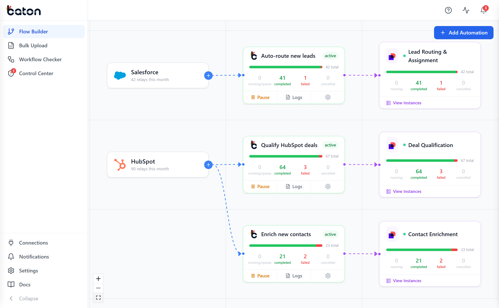
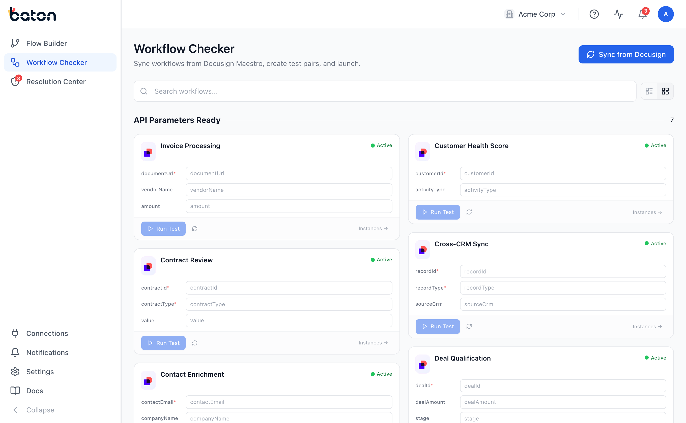
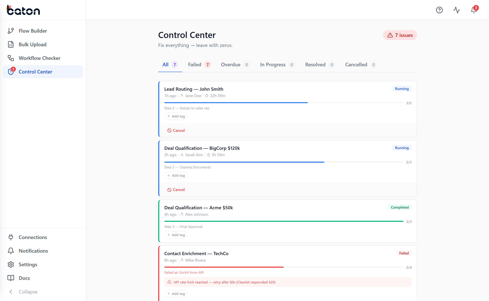
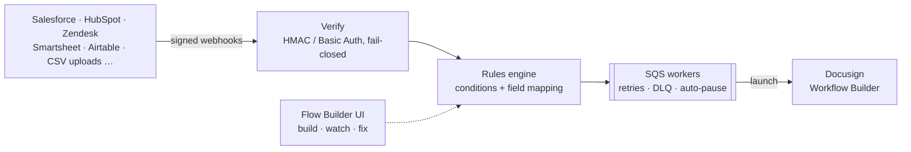
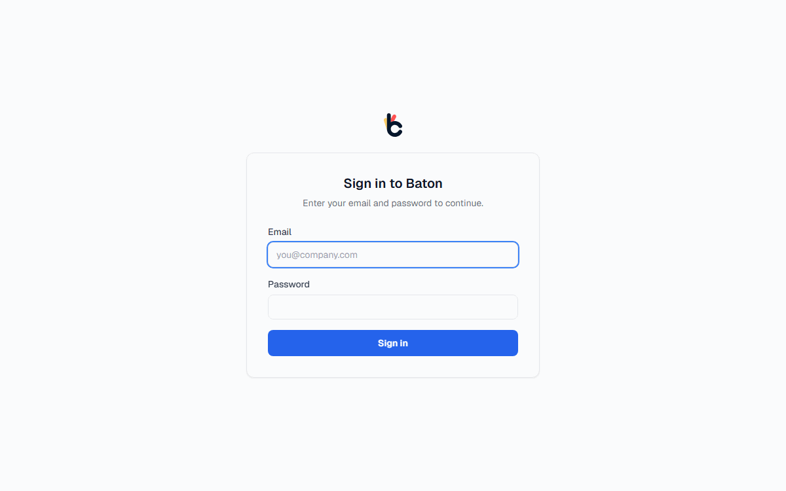

<p align="center">
  <picture>
    <source media="(prefers-color-scheme: dark)" srcset=".github/media/baton-logo-white.svg">
    
  </picture>
</p>

<h1 align="center">Baton</h1>

<p align="center"><strong>Self-hostable webhook → Docusign Workflow Builder automation.</strong><br>
Listen to the platforms you already use, verify every event, and launch the matching Docusign workflow - with a visual canvas to build, watch, and fix every automation.</p>

<p align="center">
  <a href="https://github.com/docufluidlabs/baton-core/actions/workflows/ci.yml"></a>
  <a href="https://github.com/docufluidlabs/baton-core/actions/workflows/codeql.yml"></a>
  <a href="LICENSE.md"></a>
  <a href="https://github.com/docufluidlabs/baton-core/releases"></a>
</p>

<p align="center">
  <a href="#quickstart-docker">Quickstart</a> ·
  <a href="docs/deploy-production.md">Production deploy</a> ·
  <a href="docs/security-review.md">Security review</a> ·
  <a href="UPGRADING.md">Upgrading</a> ·
  <a href="CONTRIBUTING.md">Contributing</a> ·
  <a href="https://github.com/docufluidlabs/baton-core/releases">Releases</a>
</p>

<p align="center">
  
</p>

Baton is maintained by [Fluidlabs](https://fluidlabs.com) under the fair-code [Sustainable Use License](LICENSE.md): free to self-host, modify, and use for your own business. Everything runs in **your** environment - your AWS account, your data, [no telemetry](docs/security-review.md).

## Why Baton

- **Visual Flow Builder** - a live canvas of platform → automation → workflow with per-automation relay counts, logs, and inline editing
- **Bulk Upload** - launch a workflow for every row of a CSV, XLSX, or TSV file: map columns to workflow inputs, throttle the release rate, run files concurrently, and track every row to its instance
- **Control Center** - every failed workflow run in one queue: retry, cancel, postpone; automations auto-pause when their failure rate spikes
- **Verified ingress** - signed sources are checked with HMAC signatures (constant-time) or Basic Auth and fail closed; platforms that cannot sign use per-rule secret URLs; secrets are stored encrypted (AES-256-GCM)
- **Async pipeline** - webhooks are stored idempotently, queued to SQS, and processed by workers with retries and dead-letter queues
- **Self-contained auth** - first-run owner setup, email/password sessions, copyable invite links (no SMTP), owner/admin/member/viewer roles - no external auth or billing service
- **Notifications** - in-app and [Slack](docs/slack-notifications.md) (optional email via Resend), with per-user preferences
- **Docs built in** - a full documentation site ships inside the app at `/docs`

| Workflow Checker - sync & test Docusign workflows | Control Center - fix everything, leave with zeros |
|---|---|
|  |  |

## How it works



| Package | Description | Port |
|---------|-------------|------|
| [baton/](baton/) | Express + TypeScript API, SQS workers, rule engine | 3001 |
| [baton-front/](baton-front/) | React 18 + Vite SPA (flow builder, control center, docs) | 3002 (dev) / 80 (Docker) |

## Supported platforms

**Destination:** Docusign Workflow Builder (OAuth).

**Sources:** Salesforce, HubSpot, Zoho CRM, Zendesk, BambooHR, Microsoft Power Automate, Smartsheet, Airtable, Greenhouse, monday.com - plus **custom POST webhooks** for any system that can send JSON.

Adding a platform is one connector class + one catalog entry - see [CONTRIBUTING.md](CONTRIBUTING.md).

## Quickstart (Docker)

Prerequisites: Docker with Compose. No accounts, no license keys, no host-side Node.

```bash
git clone https://github.com/docufluidlabs/baton-core.git
cd baton-core
cp baton/.env.example baton/.env

# generate the two secrets Baton needs
# (paste the values into baton/.env as TOKEN_ENCRYPTION_KEY and AUTH_JWT_SECRET)
openssl rand -hex 32
openssl rand -hex 32

docker compose up -d   # pulls the published images; add --build to build from source
```

Open **http://localhost** - the first boot creates all DynamoDB tables and SQS queues automatically in the bundled local emulators (DynamoDB Local + ElasticMQ - free, no accounts), and the first visit walks you through creating your organization and owner account.

<p align="center">
  
</p>

To receive real webhooks from external platforms, expose the app on a public URL (reverse proxy or tunnel) and set `APP_URL`/`API_URL` accordingly. To launch real workflows, add your Docusign developer app credentials - the in-app guided setup walks through every field (the defaults point at Docusign's free developer sandbox).

### Updating

Releases follow [semver](https://github.com/docufluidlabs/baton-core/releases): patch = fixes, minor = backward-compatible features, major = action required (called out in the release notes). Pin the version in a root-level `.env` next to `docker-compose.yml`:

```bash
echo "BATON_VERSION=1.0.0" > .env
docker compose pull && docker compose up -d
```

Upgrades never touch your data - it lives in your DynamoDB (or the `dynamodb-data` volume) and `baton/.env`. New tables and queues are created automatically on boot. Full guide: [UPGRADING.md](UPGRADING.md).

## Deploying on AWS

The quickstart runs on free local emulators for evaluation. For production, follow **[docs/deploy-production.md](docs/deploy-production.md)**: CloudFormation stacks for the tables/queues/IAM (in [baton/infrastructure/](baton/infrastructure/), generated from the app's own schema), the pull-only [docker-compose.prod.yml](docker-compose.prod.yml), TLS, backups, and upgrades.

**Security teams:** start at **[docs/security-review.md](docs/security-review.md)** - the complete outbound-connection inventory, crypto details, auth model, and commands to verify every claim yourself.

## Tech stack

Node 20 + Express + TypeScript · DynamoDB + SQS (AWS, or local emulators for evaluation) · React 18 + Vite + Tailwind · ReactFlow canvas · Vitest + Playwright · Pino logging · Helmet + per-IP rate limiting

## Local development

See [CONTRIBUTING.md](CONTRIBUTING.md) for the dev-server setup, test commands, and the connector-contribution guide. Detailed environment reference: [baton/docs/SETUP.md](baton/docs/SETUP.md).

## License & hosted edition

This repository is licensed under the [Sustainable Use License](LICENSE.md) (fair-code): use it freely inside your business; don't resell it as a hosted service. The Salesforce package works against any Baton instance, self-hosted or cloud. Fluidlabs also offers a managed cloud edition with multi-org management, SSO, and support - the core you see here is the same engine.

Security reports: see [SECURITY.md](SECURITY.md). Questions & ideas: [GitHub Discussions](https://github.com/docufluidlabs/baton-core/discussions).
